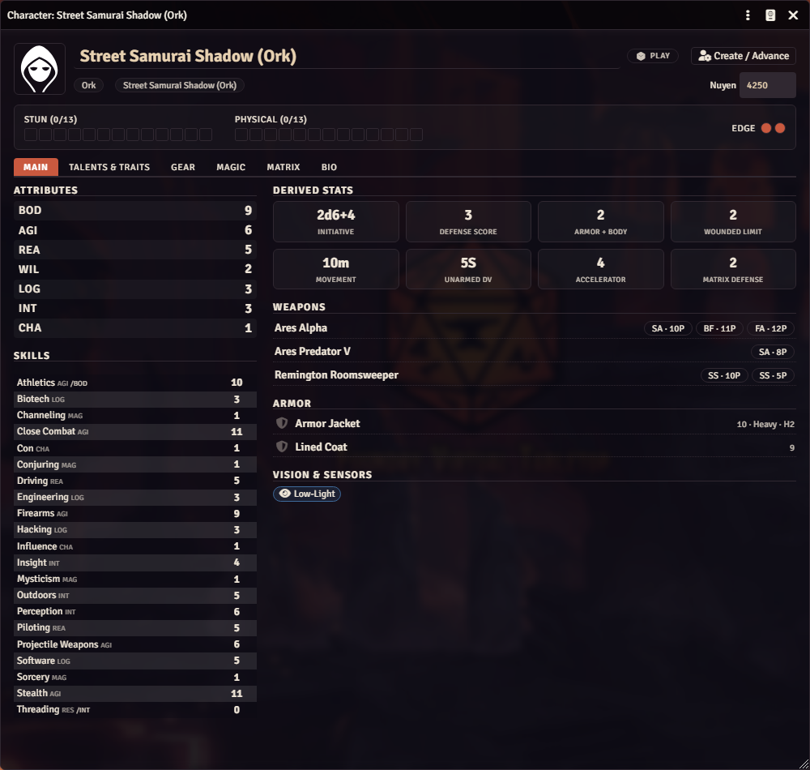
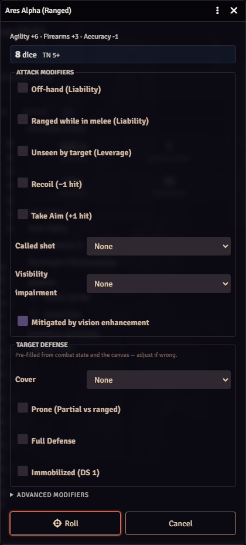
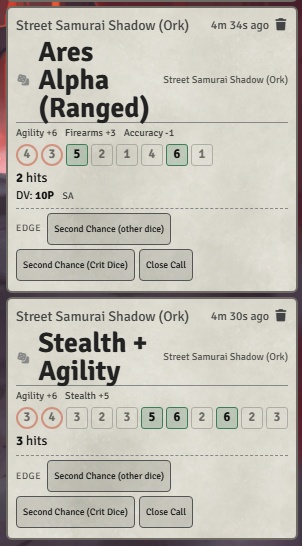
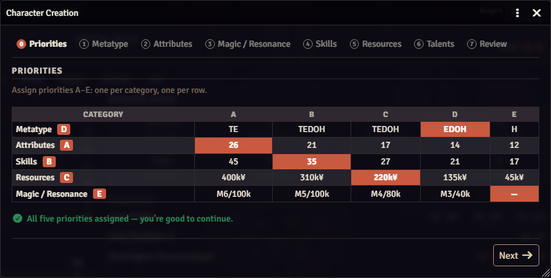
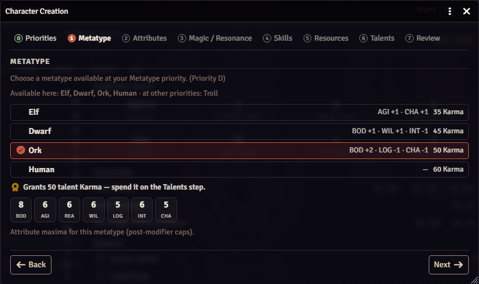

# SRX — Shadowrun Edition X for Foundry VTT (Unofficial)

A free, fan-made game system for [Foundry Virtual Tabletop](https://foundryvtt.com) (**v14+**) implementing **SRX — Shadowrun Edition X**, the free, streamlined fan edition of Shadowrun. Dice pools, Edge, combat, magic, the Matrix, rigging, and character creation are all automated — and the full SRX gear/spell/talent catalog ships in the box.



## What you get

- **SRX dice, automated.** Click a skill or weapon and get a pre-roll dialog with the dice pool spelled out, situational modifiers, called shots, cover, and visibility. Results land in chat with hits, glitches, thresholds, and one-click Edge spends (Second Chance, Crit Dice, Close Call).
- **Full combat loop.** Multi-pass initiative, an attack → defend → resist → apply damage pipeline, suppressive fire, AOE templates, statuses, condition monitors with System Shock, and healing/first aid. Automation level is configurable in settings.
- **Magic.** Spellcasting with drain and sustaining (mirrored as Active Effects), spirit summoning with enforced services and expiry, foci bonding, astral perception/projection, and warding.
- **Matrix.** Persona state (AR/VR/hot-sim), hacking vs. MDS with IC and biofeedback, host sheets, programs, devices, agents, and full technomancer support (Living Persona, sprites, Fading).
- **Vehicles & drones.** Control modes, handling/speed tests, ram/crash, weapon mounts, drone control, and a chase tracker with per-turn range automation.
- **Character creation & advancement.** A priority-build wizard that walks you from priorities to a legal, playable character, plus a Karma advancement panel with a running ledger.

<table>
  <tr>
    <td width="50%"></td>
    <td width="50%"></td>
  </tr>
  <tr>
    <td align="center"><em>Pre-roll dialog: pool breakdown, modifiers, target defense</em></td>
    <td align="center"><em>Chat cards: dice, hits, DV, and Edge spends</em></td>
  </tr>
</table>

### Content included

The full SRX catalog is bundled as compendium packs — **1,600+ documents** across nine packs: 150 weapons, armor, 400+ pieces of gear and augments, 79 spells, magic gear, 560+ talents and traits, contacts and knowledge, 65 pregen characters, and 100 threats and critters. Imported gear and talents apply their bonuses automatically via Active Effects. This content is redistributed with the permission of the SRX creator.

There's also a GM importer if you want to load your own data from SRX Character Builder `.txt.deploy` files (*Game Settings → SRX Content Import*), with dedupe and bulk Active Effect generation.

## Character creation

Click **Create / Advance** on any character sheet to launch the priority wizard. It enforces the SRX rules at every step — priorities, metatype, attribute caps, skills, resources, and talents — and writes a legal, playable character at the end. Or skip it entirely and pull one of the 65 pregens out of the compendium.

<table>
  <tr>
    <td width="55%"></td>
    <td width="45%"></td>
  </tr>
</table>

## Installation

### Via manifest URL (recommended)

1. In the Foundry setup screen, open **Game Systems → Install System**.
2. Paste this into the *Manifest URL* field and click **Install**:

   ```
   https://github.com/NateR124/srx-foundry-vtt/releases/latest/download/system.json
   ```

3. Create a **World** using **SRX — Shadowrun Edition X (Unofficial)**.

> The manifest URL resolves once the first `vX.Y.Z` GitHub release is tagged. Until then, use the manual install below.

### Manual (local / development)

1. Copy or symlink this folder to Foundry `Data/systems/srx` (the folder name must match the system id: `srx`).
2. Launch Foundry v14+ and create a world using the SRX system.

## Getting started

1. **Make a character** — open a character sheet and click **Create / Advance**, or import a pregen from the *SRX Pregen Characters* compendium.
2. **Kit them out** — drag weapons, armor, gear, and spells from the compendium packs onto the sheet.
3. **Learn the loop** — the built-in *SRX Quick-Start — The 15-Minute Fight* journal (in *SRX — Guides & Quick-Start*) walks the combat loop end to end, and the *GM Setup Guide* covers everything else.

You'll want the free SRX rulebook from the SRX team at hand for the rules themselves — the system automates them but doesn't reprint them.

## Development

```bash
npm install
npm test              # vitest — pure rules + import parsers (419 tests)
npm run build:packs   # compile packs-src/** -> packs/** (needs @foundryvtt/foundryvtt-cli)
```

Rules math lives in `module/rules/` as pure functions with no Foundry imports, so it's unit-testable outside Foundry. Foundry-facing code wraps it under `module/combat`, `module/magic`, `module/matrix`, `module/vehicle`, `module/chargen`, and `module/apps`. Compendium sources are JSON files under `packs-src/`.

## Legal

Shadowrun is a registered trademark and/or trademark of The Topps Company, Inc., in the United States and/or other countries. This is a free, noncommercial fan project. It is not published, endorsed by, or affiliated with The Topps Company, Catalyst Game Labs, or the SRX team. No rules text, artwork, logos, or other proprietary material from any official Shadowrun product is included. The bundled SRX-derived catalog content is redistributed with the permission of the SRX creator; the SRX rulebook itself is not included and is available for free from the SRX team. This system will be removed or modified immediately upon request of any rights holder.

## License

MIT — see [LICENSE](LICENSE).
